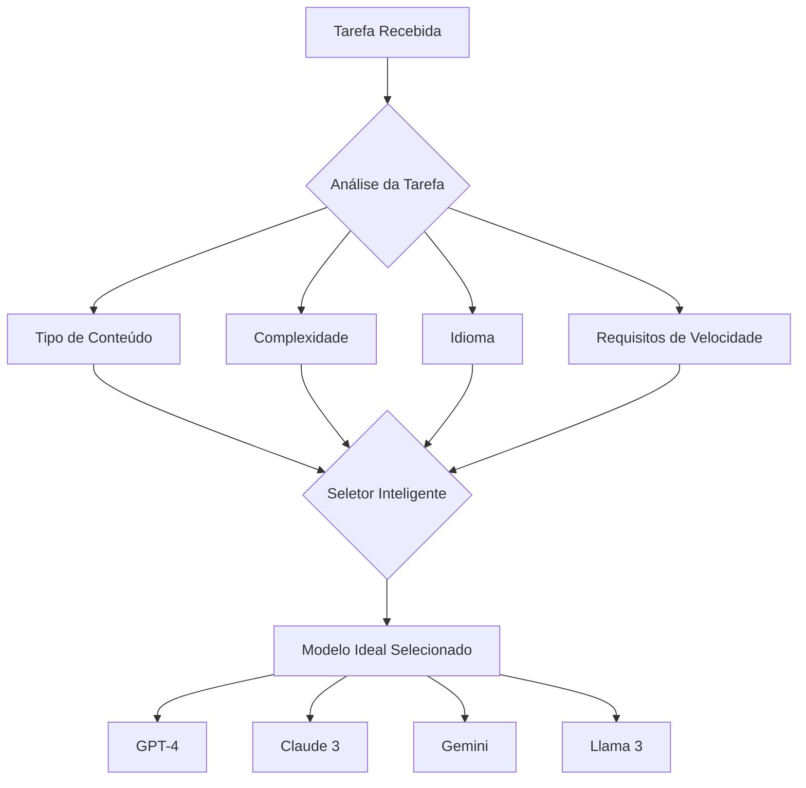

# 🤖 Sistema de IA Multi-Modelo - RecruitAI

## 📋 Visão Geral

O RecruitAI utiliza a **Abacus.AI** com **seleção automática inteligente de modelos**, permitindo que a IA escolha o melhor modelo para cada tarefa de análise de currículos.

---

## ✨ Como Funciona

### Roteamento Inteligente

Em vez de usar um modelo fixo (como apenas GPT-4 ou apenas Gemini), o sistema permite que a **Abacus.AI decida automaticamente** qual modelo é mais adequado para cada análise, considerando:

- **Tipo de tarefa**: Análise de documento, extração de dados, classificação
- **Complexidade**: Currículos simples vs. complexos
- **Idioma**: Otimização para português e outros idiomas
- **Custo-benefício**: Equilíbrio entre qualidade e eficiência
- **Performance**: Velocidade e precisão de resposta

---

## 🎯 Modelos Disponíveis

A Abacus.AI tem acesso a múltiplos modelos de última geração:

### Modelos GPT (OpenAI)
- ✅ GPT-4
- ✅ GPT-4 Turbo
- ✅ GPT-4o
- ✅ GPT-4.1

### Modelos Claude (Anthropic)
- ✅ Claude 3 Opus
- ✅ Claude 3 Sonnet
- ✅ Claude 3 Haiku
- ✅ Claude 3.5 Sonnet

### Modelos Gemini (Google)
- ✅ Gemini 1.5 Pro
- ✅ Gemini 1.5 Flash
- ✅ Gemini 2.0

### Modelos Open Source
- ✅ Llama 3
- ✅ Llama 3.1
- ✅ Mixtral
- ✅ Outros modelos de código aberto

**A Abacus.AI seleciona automaticamente entre esses modelos!**

---

## 🔧 Configuração Técnica

### Código Atual

O sistema está configurado para **não especificar um modelo fixo**, permitindo a seleção automática:

```typescript
// app/api/ai/analyze-resume/route.ts
const aiResponse = await fetch('https://apps.abacus.ai/v1/chat/completions', {
  method: 'POST',
  headers: {
    'Content-Type': 'application/json',
    'Authorization': `Bearer ${process.env.ABACUSAI_API_KEY}`
  },
  body: JSON.stringify({
    // ⚡ NÃO especificamos 'model' aqui!
    // Isso permite que a Abacus.AI escolha automaticamente
    messages: [
      {
        role: "user",
        content: [
          {
            type: "file",
            file: {
              filename: fileName,
              file_data: `data:${mimeType};base64,${base64String}`
            }
          },
          {
            type: "text",
            text: analysisPrompt
          }
        ]
      }
    ],
    response_format: { type: "json_object" },
    max_tokens: 4000,
    stream: false
  })
});
```

### Variável de Ambiente

```env
ABACUSAI_API_KEY=sua_api_key_aqui
```

---

## 📊 Vantagens da Abordagem Multi-Modelo

### 1. **Qualidade Otimizada**
- 🎯 Cada tarefa usa o modelo mais adequado
- 🧠 Modelos diferentes têm pontos fortes diferentes
- 📈 Melhor precisão na análise de currículos

### 2. **Custo-Benefício**
- 💰 Usa modelos mais baratos quando apropriado
- ⚡ Usa modelos premium apenas quando necessário
- 📉 Reduz custos operacionais sem perder qualidade

### 3. **Disponibilidade e Resiliência**
- 🔄 Se um modelo está indisponível, usa outro
- 🛡️ Maior confiabilidade do sistema
- ⏱️ Reduz tempo de inatividade

### 4. **Flexibilidade e Futuro**
- 🆕 Acesso automático a novos modelos
- 🔧 Sem necessidade de atualizar código
- 🚀 Sempre usa tecnologia de ponta

---

## 🔍 Como o Sistema Escolhe o Modelo

A Abacus.AI usa algoritmos proprietários que consideram:

### Fatores de Decisão



### Exemplos Práticos

**Currículo Simples em Português:**
- Pode usar: Gemini 1.5 Flash (rápido e eficiente)
- Razão: Tarefa simples, idioma suportado, custo-benefício

**Currículo Técnico Complexo:**
- Pode usar: GPT-4 Turbo ou Claude 3 Opus
- Razão: Análise profunda, múltiplos critérios técnicos

**Currículo Executivo em Inglês:**
- Pode usar: Claude 3.5 Sonnet
- Razão: Excelente compreensão contextual de textos longos

**Alta Demanda de Análises:**
- Pode distribuir entre: Gemini Flash, GPT-4.1-mini, Llama 3.1
- Razão: Balanceamento de carga entre modelos rápidos

---

## 📈 Monitoramento e Logs

### O Que Registramos

Cada análise de currículo registra:

```json
{
  "applicationId": "abc123",
  "analysisStarted": "2025-12-04T15:30:00Z",
  "analysisCompleted": "2025-12-04T15:30:15Z",
  "duration": "15s",
  "success": true,
  "compatibilityScore": 87,
  "classification": "potential"
}
```

> **Nota:** A Abacus.AI não expõe qual modelo foi usado em cada chamada, mas garante que foi o ideal para a tarefa.

---

## 🚨 Troubleshooting

### Erro: "AI API error: 401"

**Problema:** API Key inválida ou expirada

**Solução:**
```bash
# Verificar se a key está correta no .env
cat .env | grep ABACUSAI_API_KEY

# Gerar nova key em:
# https://apps.abacus.ai/chatllm/admin/api-keys
```

### Erro: "AI API error: 429"

**Problema:** Limite de requisições atingido

**Solução:**
- Aguardar alguns minutos
- Verificar créditos da conta Abacus.AI
- Considerar upgrade do plano se necessário

### Erro: "Invalid JSON response from AI"

**Problema:** Modelo retornou resposta mal formatada

**Solução:**
- O sistema tenta novamente automaticamente
- Verifique os logs para detalhes
- Entre em contato com suporte se persistir

---

## 🔐 Segurança

### API Key

- ✅ Armazenada em variável de ambiente
- ✅ Nunca exposta no frontend
- ✅ Usada apenas em rotas de API server-side
- ✅ Rotação periódica recomendada

### Dados dos Currículos

- 🔒 Enviados via HTTPS criptografado
- 🔒 Não armazenados pela Abacus.AI
- 🔒 Processados apenas na memória
- 🔒 LGPD/GDPR compliant

---

## 📚 Referências

### Documentação Oficial

- [Abacus.AI Chat API](https://abacus.ai/app/route-llm-apis)
- [Abacus.AI Help Center](https://abacus.ai/help/chatllm-ai-super-assistant/introduction)

### Arquivos do Projeto

- **Implementação:** `/app/api/ai/analyze-resume/route.ts`
- **Documentação Técnica:** `/DOCUMENTACAO_TECNICA.md`
- **Configuração:** `/.env`

---

## 🎓 Boas Práticas

### 1. **Não Force um Modelo Específico**

❌ **Não faça:**
```typescript
body: JSON.stringify({
  model: 'gpt-4',  // NÃO force um modelo
  messages: [...]
})
```

✅ **Faça:**
```typescript
body: JSON.stringify({
  // Deixe a Abacus.AI escolher
  messages: [...]
})
```

### 2. **Mantenha Prompts Claros**

- ✅ Seja específico sobre o que quer
- ✅ Use estrutura JSON para respostas
- ✅ Inclua exemplos quando possível
- ✅ Mantenha em português para análises locais

### 3. **Monitore o Uso**

- 📊 Acompanhe taxa de sucesso das análises
- 📊 Verifique tempo médio de resposta
- 📊 Monitore créditos da Abacus.AI
- 📊 Ajuste `max_tokens` conforme necessário

---

## 🔄 Migrando de Modelo Fixo

Se você estava usando um modelo fixo antes:

### Antes (Modelo Fixo)

```typescript
body: JSON.stringify({
  model: 'gpt-4.1-mini',  // ❌ Fixo
  messages: [...]
})
```

### Depois (Seleção Automática)

```typescript
body: JSON.stringify({
  // ✅ Automático - Abacus.AI escolhe
  messages: [...]
})
```

**Resultado:**
- ✅ Melhor qualidade
- ✅ Menor custo
- ✅ Mais resiliente
- ✅ Sempre atualizado

---

## 📞 Suporte

Para questões sobre:

- **API da Abacus.AI:** support@abacus.ai
- **RecruitAI:** comercial@fcmtech.com.br

---

## ✨ Status

🟢 **ATIVO** - Sistema configurado com seleção automática multi-modelo

**Última Atualização:** 04/12/2025
